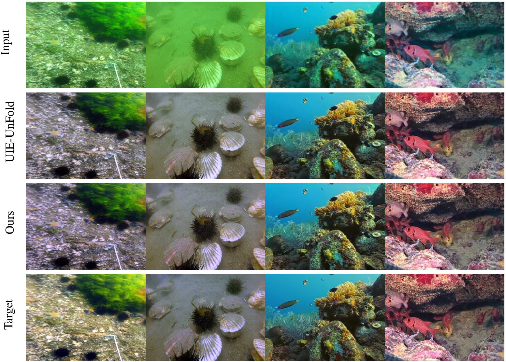
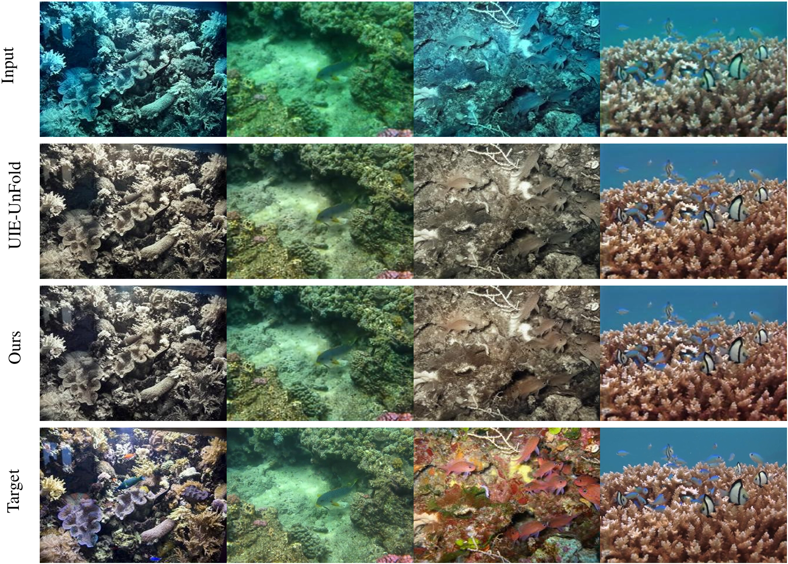
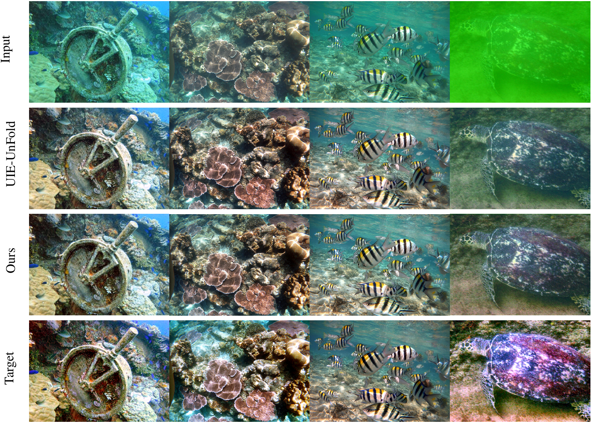
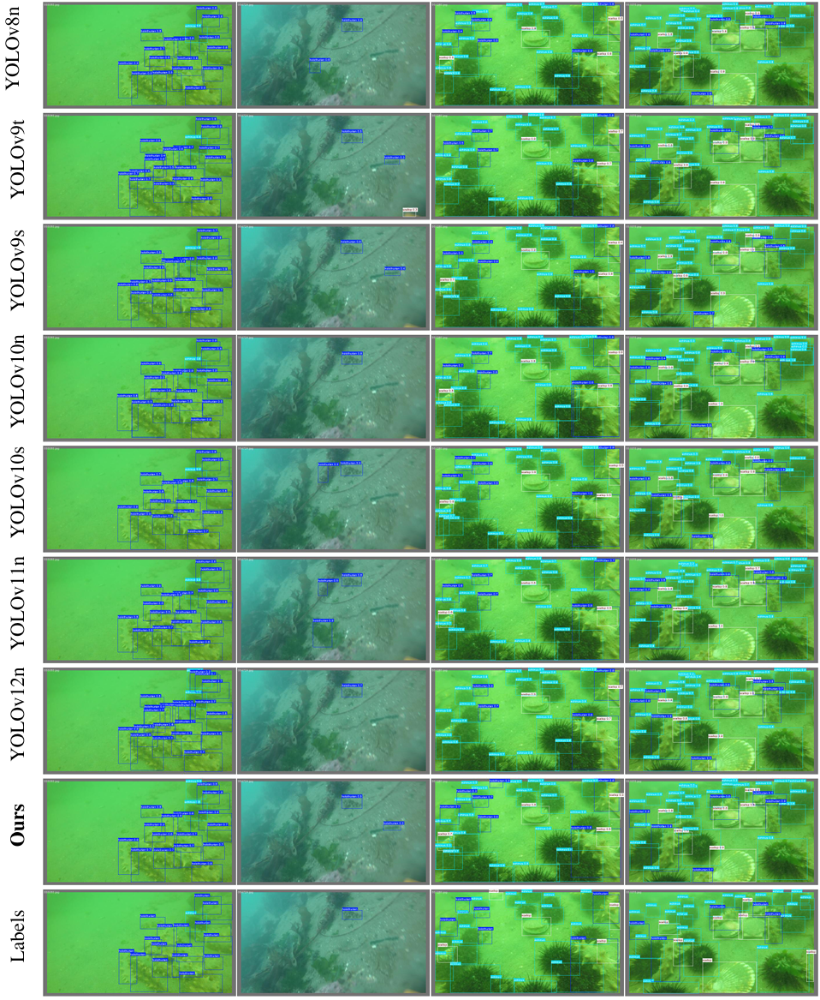
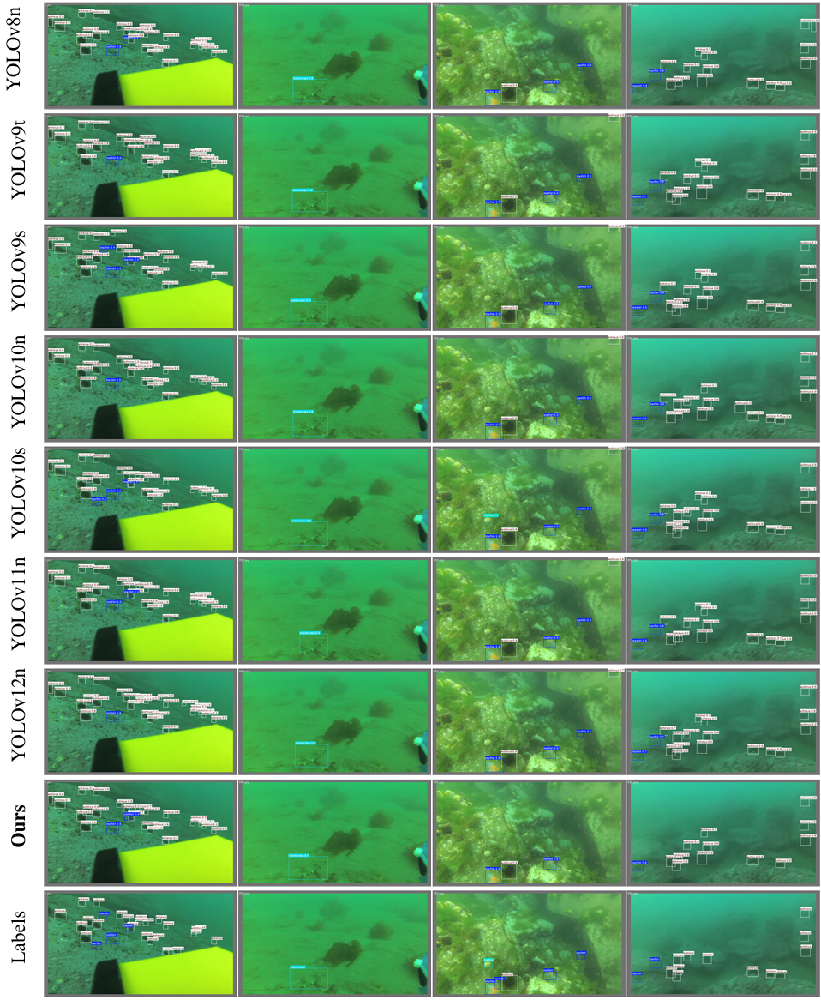

# Underwater Enhancement & Detection

[](https://www.python.org/)
[](https://pytorch.org/)
[](./LICENSE)

**Lightweight Underwater Image Enhancement & Real-Time Object Detection System**

An integrated deep learning system for underwater vision: enhance degraded underwater images with **LightAquaNet** (2.55M params, 47.6 FPS), detect marine organisms with **SEAD-YOLO** (1.80M params, state-of-the-art), and visualize results in real time through a unified desktop application (UVAIS).

> Part of the graduation thesis: *"Lightweight Underwater Image Enhancement and Object Detection Algorithm Research and Application"*

---

## System Architecture

The system uses a modular decoupling design with a serial cascade pipeline: LightAquaNet enhancement → SEAD-YOLO detection, managed by master-slave daemon thread concurrency.


```
Input → [LightAquaNet Enhancement] → [SEAD-YOLO Detection] → Annotated Output + Statistics
```

---

## UI Preview

Three-panel layout: control panel (left), dual-stream visual comparison (center), real-time analytics dashboard (right).


---

## Enhancement: LightAquaNet

### Quantitative Results

**Table 1. Image Quality Comparison Across Datasets (PSNR↑ / SSIM↑ / ΔE↓ / LPIPS↓)**

| Method | LSUI PSNR | LSUI SSIM | LSUI ΔE | LSUI LPIPS | EUVP PSNR | EUVP SSIM | EUVP ΔE | EUVP LPIPS | UIEB PSNR | UIEB SSIM | UIEB ΔE | UIEB LPIPS |
|--------|:---------:|:---------:|:-------:|:----------:|:---------:|:---------:|:-------:|:----------:|:---------:|:---------:|:-------:|:----------:|
| UIE-UnFold | 26.780 | 0.908 | 9.729 | 0.114 | **24.427** | **0.884** | **12.110** | **0.180** | 23.160 | 0.915 | 16.070 | 0.116 |
| **LightAquaNet** | **27.299** | **0.909** | **9.227** | 0.118 | 24.295 | 0.880 | 12.315 | 0.199 | **23.277** | **0.917** | **15.880** | **0.115** |

**Table 2. Computational Efficiency**

| Method | Params ↓ | GFLOPs ↓ | Latency ↓ | FPS ↑ |
|--------|:--------:|:--------:|:---------:|:-----:|
| UIE-UnFold | 4.187 M | 112.785 G | 29.13 ms | 34.33 |
| **LightAquaNet** | **2.553 M** | **79.004 G** | **20.99 ms** | **47.64** |

Key takeaways:
- **39.0%** parameter reduction, **29.9%** FLOPs reduction vs baseline
- PSNR **surpasses** UIE-UnFold on LSUI (+0.519 dB) and UIEB (+0.117 dB)
- SSIM leads on all three datasets or ties with baseline
- Inference reaches **47.64 FPS**, well above real-time threshold

### Qualitative Results

**LSUI Dataset — Complex Lighting & Color Cast:**



**EUVP Dataset — Strong Scattering & Haze:**



**UIEB Dataset — Multi-degradation (Color Fading + Low Contrast + Sediment Occlusion):**



---

## Detection: SEAD-YOLO

SEAD-YOLO is built on YOLOv8n with three key innovations: **UDP-Neck** (unidirectional feature cascade), **C2f-PStar** (PConv-based efficient operator), and **SimAM** (parameter-free 3D attention).


### Quantitative Results

**Table 3. UOD Dataset — Detection Performance (4 marine species: holothurian, echinus, scallop, starfish)**

| Method | P(%)↑ | R(%)↑ | F1(%)↑ | mAP@0.5↑ | mAP@0.5:.95↑ | Params(M)↓ | GFLOPs↓ | Size(MB)↓ |
|--------|:-----:|:-----:|:------:|:--------:|:------------:|:----------:|:-------:|:---------:|
| YOLOv8n | 89.1 | 83.2 | 86.0 | 90.3 | 54.0 | 3.01 | 8.1 | 6.0 |
| YOLOv9t | 89.0 | 78.9 | 83.6 | 89.2 | 53.2 | 1.97 | 7.6 | 4.4 |
| YOLOv9s | 87.1 | 83.9 | 85.5 | 90.0 | 54.4 | 7.17 | 26.7 | 14.5 |
| YOLOv10n | 86.4 | 80.4 | 83.3 | 88.7 | 53.7 | 2.70 | 8.2 | 5.5 |
| YOLOv10s | **89.6** | 82.3 | 85.8 | **90.8** | 54.5 | 8.04 | 24.5 | 15.8 |
| YOLOv11n | 85.9 | **85.7** | 85.8 | 90.6 | 54.0 | 2.58 | 6.3 | 5.2 |
| YOLOv12n | 85.3 | 81.1 | 83.1 | 88.6 | 52.6 | 2.51 | **5.8** | 5.2 |
| **SEAD-YOLO** | 87.6 | 84.7 | **86.1** | 90.3 | **54.9** | **1.80** | 6.0 | **3.7** |

**Table 4. DUO Dataset — Cross-Domain Generalization (includes unseen starfish class)**

| Method | P(%)↑ | R(%)↑ | F1(%)↑ | mAP@0.5↑ | mAP@0.5:.95↑ | Params(M)↓ | GFLOPs↓ | Size(MB)↓ |
|--------|:-----:|:-----:|:------:|:--------:|:------------:|:----------:|:-------:|:---------:|
| YOLOv8n | 83.5 | 72.3 | 77.5 | 81.3 | 60.9 | 3.01 | 8.1 | 6.0 |
| YOLOv9t | 81.7 | 73.7 | 77.5 | 82.0 | 62.0 | 1.97 | 7.6 | 4.4 |
| YOLOv9s | 85.9 | **85.7** | **85.8** | **90.6** | 54.0 | 7.17 | 26.7 | 14.5 |
| YOLOv10n | 81.9 | 70.5 | 75.8 | 79.6 | 59.5 | 2.70 | 8.2 | 5.5 |
| YOLOv10s | 84.9 | 75.8 | 80.1 | 84.4 | **66.0** | 8.04 | 24.5 | 15.8 |
| YOLOv11n | 82.0 | 73.4 | 77.5 | 81.0 | 60.0 | 2.58 | 6.3 | 5.2 |
| YOLOv12n | 82.6 | 69.8 | 75.7 | 79.4 | 58.8 | 2.51 | 5.8 | 5.2 |
| **SEAD-YOLO** | **85.1** | 76.9 | 80.8 | 84.4 | 64.9 | **1.80** | 6.0 | **3.7** |

Key takeaways:
- **Lowest parameters** (1.80M) among all compared models — **40.2%** smaller than YOLOv8n
- **Highest mAP@0.5:0.95** (54.9%) on UOD, **highest F1** (86.1%) on UOD
- On DUO cross-domain: mAP@0.5 **+3.1%** over YOLOv8n at same scale, mAP@0.5:0.95 **+4.0%**
- Physical size only **3.7 MB** — ideal for edge deployment (NVIDIA Jetson, etc.)

### Qualitative Results

**UOD Dataset — Detection comparison across models:**



**DUO Dataset — Cross-domain detection comparison:**



---

## Directory Structure

```
Underwater-Enhancement-Detection/
├── enhancement/                  # Image enhancement module
│   ├── train.py                  # Train LightAquaNet
│   ├── test.py                   # Evaluate on test set
│   ├── eval_model.py             # Params, GFLOPs, FPS benchmark
│   ├── compare.py                # Cross-method PSNR/SSIM/LPIPS/DeltaE comparison
│   ├── config.yml                # Training configuration
│   ├── config/                   # YACS config manager
│   ├── models/                   # LightAquaNet model definition
│   ├── data/                     # Data loaders
│   ├── loss/                     # Loss functions
│   └── utils/                    # Seed, checkpoint utilities
│
├── detection/                    # Object detection module
│   ├── train.py                  # Train YOLO detection model
│   ├── predict.py                # Run detection on images/videos
│   ├── app.py                    # Gradio web demo
│   ├── pt_to_onnx.py             # Export models to ONNX format
│   ├── WIModel.py                # LightAquaNet + performance evaluation
│   ├── ultralytics/              # YOLOv12 framework
│   ├── Test/                     # Test scripts (UOD/DUO benchmark)
│   └── data1.yaml / data2.yaml   # Underwater dataset configs
│
├── ui/                           # Visualization
│   └── compare_ui.py             # Desktop UI: enhancement + detection compare
│
├── weights/                      # Pretrained weights (download separately)
│
├── requirements.txt
└── README.md
```

---

## Installation

```bash
git clone https://github.com/HR-Xie/Underwater-Enhancement-Detection.git
cd Underwater-Enhancement-Detection
pip install -r requirements.txt
```

---

## Pretrained Weights

Model weights are **not** included in the repository. Place downloaded files in `weights/`:

| Weight | Description | Size |
|--------|-------------|------|
| `UW_epoch_277.pth` | LightAquaNet enhancement model | ~29 MB |
| `yolov8n.pt` | YOLOv8n base detection model | ~6 MB |
| `LightAquaNet.onnx` | LightAquaNet ONNX export | ~10 MB |
| `best.pt` | Trained SEAD-YOLO underwater detection | ~TBD |

---

## Usage

### 1. Image Enhancement

```bash
cd enhancement
python train.py          # Train LightAquaNet
python test.py           # Evaluate on test set
python eval_model.py     # Benchmark: Params, GFLOPs, FPS
python compare.py        # Cross-method PSNR/SSIM/LPIPS/DeltaE comparison
```

Edit `enhancement/config.yml` to configure training parameters, dataset paths, and model settings.

### 2. Object Detection

```bash
cd detection
# Train on underwater dataset
python train.py --data data1.yaml --model ../weights/yolov8n.pt --epochs 100 --batch 16

# Resume from trained weights
python train.py --data data1.yaml --model ../weights/best.pt --epochs 200

# Run prediction
python predict.py --source ./Test/images --model ../weights/best.pt --conf 0.5

# Export to ONNX
python pt_to_onnx.py
```

### 3. Interactive UI

```bash
cd ui
python compare_ui.py
```

Features:
- Toggle enhancement (LightAquaNet) and detection (SEAD-YOLO) independently
- Real-time side-by-side comparison: original vs. processed frames
- Live statistics dashboard: class counts, confidence
- Performance monitoring: latency (ms), FPS
- Supports both images and videos

---

## Key Features

### LightAquaNet Enhancement
- **Large Kernel Attention (LKA)** with dilated convolutions (RF up to 21×21)
- **Depthwise separable convolutions** for spatial/channel decoupling
- **NAFBlock** with SimpleGate activation and channel attention (SCA)
- **Gated fusion** with learnable β/γ parameters for adaptive branch merging
- Only **2.55M params**, **79 GFLOPs**, **47.6 FPS** inference

### SEAD-YOLO Detection
- **UDP-Neck**: Unidirectional feature cascade — removes bottom-up noise path
- **C2f-PStar**: PConv-based operator with star-shaped feature extraction
- **SimAM**: Parameter-free 3D energy attention for camouflage penetration
- Only **1.80M params**, **3.7 MB** disk, **6.0 GFLOPs**

### UVAIS Desktop Application
- Built with **customtkinter** (GPU-accelerated, Dark Mode)
- Master-slave daemon thread architecture: GUI stays responsive during inference
- Memory contiguous alignment + adaptive input scaling for edge deployment

---

## License

MIT License. See [LICENSE](./LICENSE) for details.

---

## Citation

```bibtex
@thesis{underwater-enhance-detection,
  title  = {Lightweight Underwater Image Enhancement and Object Detection Algorithm Research and Application},
  author = {Your Name},
  school = {Your University},
  year   = {2025},
}
```
